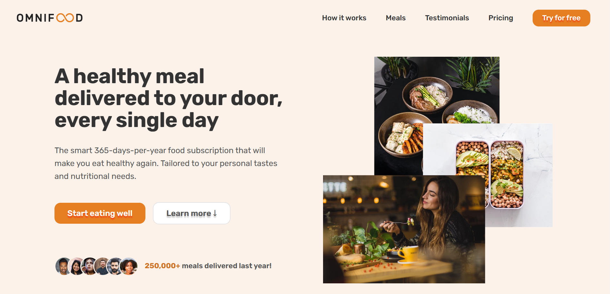
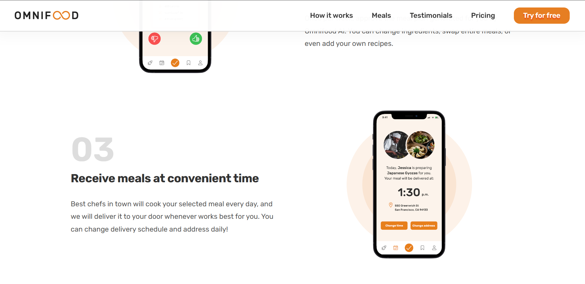
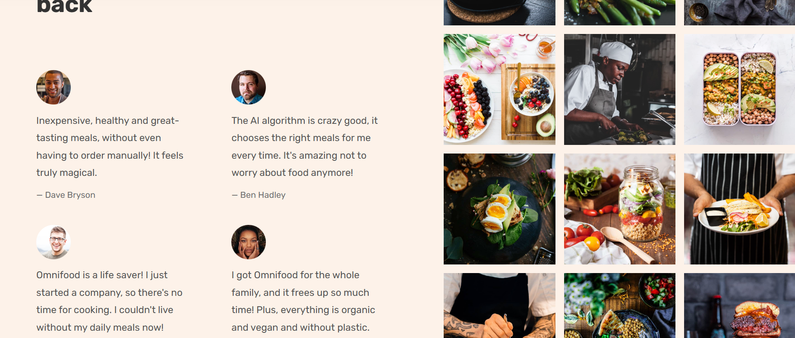
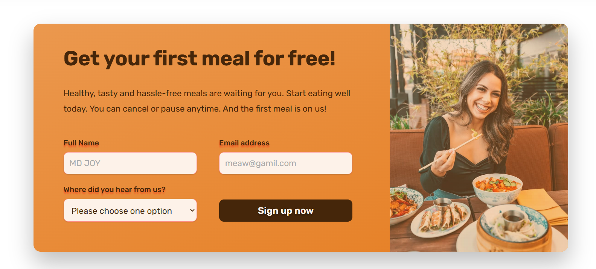
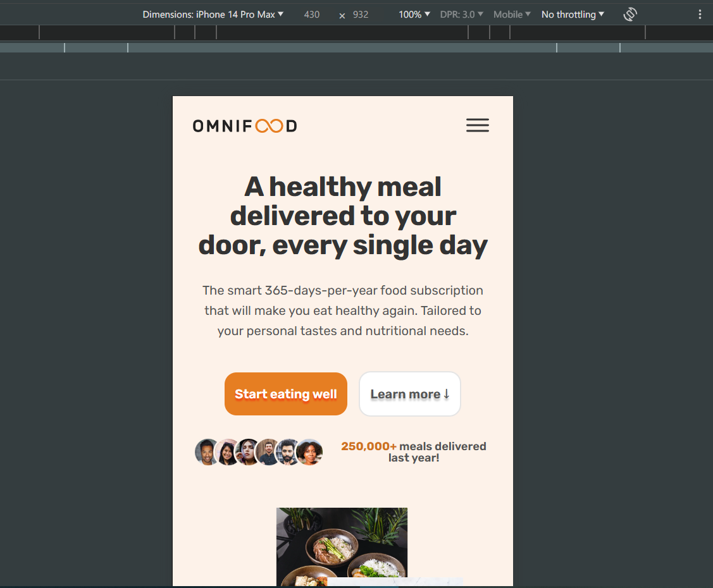

  

# Project Title

This project is based on Jonas Schmedtmann's [HTML & CSS](https://www.udemy.com/user/jonasschmedtmann/) course. You should check his course. All the credits go to my beautiful teacher Jonas Schmedtmann--

## Omnifood---RESPONSIVE-WEBSITE

✅[View demo](https://ph0enix46.github.io/Omnifood---RESPONSIVE-WEBSITE/) 🐛[Bug report](https://github.com/pH0enix46/Omnifood---RESPONSIVE-WEBSITE/issues)


## About
We are a technology company first, but with a major focus on consumer well-being through a healthy diet. Most people are very busy with their jobs, family and friends, and other important activities, which doesn't leave much time for cooking. 

We want to solve this problem by using an AI-centric approach. Users can use our app to select their diet and foods they like and dislike, and our AI algorithm will create a custom and individual weekly meal plan. 

All this will be packed up in a monthly subscription, where users can choose between receiving one or two meals per day, every single day of the month.

## Screenshots









## Installation

Clone the repo
```
https://github.com/pH0enix46/Omnifood---RESPONSIVE-WEBSITE.git
```
✅Enjoy! for learning 

❌But don't copy mine
## Acknowledgments
My lovely teacher [Jonas Schmedtmann](https://github.com/jonasschmedtmann)


```
Have a nice Day!😸
```
